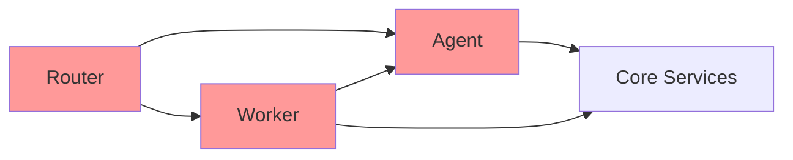

# RemoteDevelop Project Retrospective
## Failure Registry & Lessons Learned

> **프로젝트 기간**: 2026-01-08 ~ 2026-01-14
> **목적**: 이 문서는 다음 반복 개발 시 같은 실수를 반복하지 않기 위한 참조 자료입니다.

---

## 1. 아키텍처 실패 패턴

### 1.1 Scope Creep (범위 확장)

| 초기 설계 | 최종 결과 | 문제점 |
|-----------|-----------|--------|
| 3-4개 에이전트 파이프라인 | 11개 에이전트 | 관리 복잡도 증가, 테스트 어려움 |
| 단일 LLM (OpenAI) | Multi-LLM (OpenAI + Claude CLI + Cursor CLI) | 어댑터 패턴 추가, 설정 복잡도 증가 |
| 간단한 큐 | Redis + SQLite + ChromaDB | 상태 관리 분산, 디버깅 어려움 |

**교훈**: 
- 처음부터 확장성을 고려하되, 실제 확장은 점진적으로 해야 함
- 에이전트 개수를 3-4개로 제한하고, 나머지는 플러그인/확장으로 처리

---

### 1.2 Tight Coupling (강한 결합)

```
# 예시: code_agent.py의 의존성
from core.prompt_manager import PromptManager
from core.git_service import GitService
from core.github_service import get_github_service
from core.pr_wait_service import get_pr_wait_service
from core.rag_service import get_rag_service  # process() 내부에서 import
```

**문제점**:
- 하나의 에이전트가 5개 이상의 core 서비스에 직접 의존
- 테스트를 위해 모든 서비스를 Mock해야 함
- 서비스 변경 시 모든 에이전트 영향

**교훈**:
- 에이전트는 입력(context)만 받고 출력(result)만 반환해야 함
- 외부 서비스 호출은 Orchestrator나 Middleware에서 처리
- Dependency Injection 패턴 사용

---

### 1.3 God Objects (거대 객체)

| 파일 | 라인 수 | 문제점 |
|------|---------|--------|
| `routers/agent_router.py` | 690 lines | Pending, Approval, Debug, Queue 로직 혼재 |
| `core/worker.py` | 228 lines | 10+ 중첩 if/else 분기 |
| `core/database.py` | 10,498 bytes | 설정, 태스크, 레포지토리 모두 처리 |

**교훈**:
- 파일당 200 라인 이하 유지
- 단일 책임 원칙 엄수
- 라우터는 요청/응답만, 로직은 서비스 레이어에서 처리

---

### 1.4 Missing Separation of Concerns



**현재 구조의 문제**:
- Router가 직접 Agent를 호출하기도 하고, Worker가 호출하기도 함
- 동일한 로직이 `agent_router.py`와 `worker.py`에 중복
- 어디서 에러가 발생했는지 추적 어려움

**교훈**:
- 명확한 레이어 분리: Router → Service → Repository
- 에이전트 호출은 단일 진입점(Orchestrator)을 통해서만

---

## 2. 작동하지 않았던 기능들

### 2.1 n8n 워크플로우 통합
- **의도**: Telegram → n8n → Backend 파이프라인
- **결과**: n8n 없이 직접 API 호출로 변경
- **실패 원인**: n8n 설정/유지보수 오버헤드, 디버깅 어려움

### 2.2 Workflow State Machine
- **의도**: WorkItem 기반 상태 관리 (`workflow/orchestrator.py`)
- **결과**: 이벤트 기반 파이프라인과 혼재
- **실패 원인**: 두 시스템이 공존하면서 복잡도만 증가

### 2.3 Human-in-the-loop Approval Gates
- **의도**: UX/ARCH/RELEASE에서 승인 대기
- **결과**: 부분적으로만 작동
- **실패 원인**: 승인 상태가 Redis와 DB에 분산 저장

### 2.4 자동 RAG 인덱싱
- **의도**: 10분마다 레포지토리 자동 인덱싱
- **문제**: 인덱싱 완료 전 쿼리 시 빈 결과 반환

---

## 3. 대화 기록에서 발견된 패턴

### 3.1 아키텍처 방향 전환 (Pivots)
1. **선형 파이프라인 → 이벤트 드리븐** (01-08)
2. **3개 에이전트 → 11개 에이전트** (01-10)
3. **WorkItem 도입 → 이벤트와 혼재** (01-10)
4. **MCP 서버 통합 시도** (01-12)

**교훈**: 잦은 방향 전환은 기술 부채 누적의 주 원인

### 3.2 반복된 문제
- Frontend agent 표시 문제 (여러 번 수정)
- 환경변수/설정 관리 혼란
- Cloudflare 터널 자동화 시도 (복잡도만 증가)

---

## 4. 다음에 해야 할 것 (Next Iteration)

### 4.1 아키텍처 원칙

> [!IMPORTANT]
> **Core Principle**: 에이전트는 순수 함수처럼 동작해야 함
> - Input: context (dict)
> - Output: result (dict)
> - Side Effects: NONE

```python
# 좋은 예
class Agent:
    def process(self, context: dict) -> dict:
        return {"output": "..."}  # Pure function

# 나쁜 예 (현재)
class Agent:
    def process(self, event: dict) -> dict:
        git = GitService(...)  # Side effect
        git.commit(...)        # Side effect
        redis.push(...)        # Side effect
        return event
```

### 4.2 추천 기술 스택

| 컴포넌트 | 추천 | 이유 |
|----------|------|------|
| Queue | Redis (유지) | 충분히 작동함 |
| State | Redis만 사용 | SQLite와 분산 저장 금지 |
| LLM | 단일 어댑터 | Multi-LLM은 나중에 |
| Agent 수 | 3-4개 | Planning, Coding, Review, Deploy |

### 4.3 레이어 분리

```
┌─────────────────────────────────────┐
│           API Layer                 │  ← FastAPI routers
├─────────────────────────────────────┤
│         Orchestrator                │  ← 단일 진입점, 상태 관리
├─────────────────────────────────────┤
│           Agents                    │  ← 순수 함수, 사이드 이펙트 없음
├─────────────────────────────────────┤
│         Tool Layer                  │  ← Git, LLM, RAG (Orchestrator가 호출)
└─────────────────────────────────────┘
```

---

## 5. 유지할 것들

### 5.1 잘 작동한 부분
- **Strategy Pattern for Agents**: 에이전트 추가/교체 용이
- **YAML 기반 프롬프트 관리**: 코드 분리 성공
- **Redis 큐 기본 구조**: 이벤트 푸시/팝 안정적

### 5.2 재사용 가능 코드
- `core/prompt_manager.py`: YAML 프롬프트 로더
- `core/redis_client.py`: 기본 큐 연산 (단순화 필요)
- `agents/base.py`: AgentStrategy 추상 클래스 (간소화 필요)

---

## 6. 이 문서 사용법

> [!TIP]
> 다음 개발 시작 시 이 문서를 먼저 읽고 시작하세요.

1. **Section 1-2 검토**: 같은 실수 반복 방지
2. **Section 4 참조**: 아키텍처 설계 시 기준점
3. **Section 5 활용**: 재사용 가능한 코드 파악

---

*Generated: 2026-01-14*
