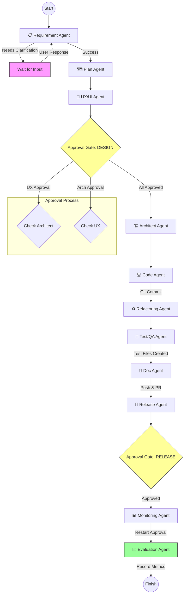

# Agent Flowchart

Visualizes the flow of data through the **11-agent** pipeline.

## Agent Summary (11 Agents)

| # | Agent | Role | Output |
|---|-------|------|--------|
| 1 | REQUIREMENT | 요구사항 정제 | 명확한 요구사항 또는 질문 |
| 2 | PLAN | 로드맵/태스크 분해 | 프로젝트 계획 (Markdown) |
| 3 | UXUI | UX/UI 설계 | 사용자 플로우, 디자인 시스템 |
| 4 | ARCHITECT | 아키텍처 설계 | 기술 스택, 디렉토리 구조 |
| 5 | CODE | 코드 구현 | 실제 코드 파일 (Git Commit) |
| 6 | REFACTORING | 코드 리뷰 | 개선점 제안 |
| 7 | TESTQA | 테스트 작성 | 테스트 코드 (Git Commit) |
| 8 | DOC | 문서화 | README 등 (Git Commit + PR) |
| 9 | RELEASE | 배포 점검 | 릴리즈 노트 |
| 10 | MONITORING | 모니터링 설정 | 재시작 승인 요청 |
| 11 | EVALUATION | 성과 평가 | 성취도 점수, 개선점 |
