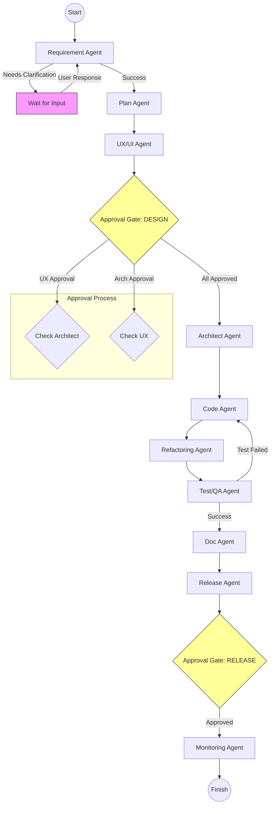

# Agent Flowchart

Visualizes the flow of data through the 10-agent pipeline.

```mermaid
flowchart TD
    Start((Start)) --> REQ[Requirement Agent]
    
    REQ -->|Needs Clarification| WAIT_CLARIF[Wait for Input]
    WAIT_CLARIF -->|User Response| REQ
    REQ -->|Success| PLAN[Plan Agent]
    
    PLAN --> UXUI[UX/UI Agent]
    
    UXUI --> DESIGN_GATE{Approval Gate: DESIGN}
    DESIGN_GATE -->|UX Approval| CHECK_ARCH
    DESIGN_GATE -->|Arch Approval| CHECK_UX
    
    subgraph Approval Process
        CHECK_ARCH{Check Architect}
        CHECK_UX{Check UX}
    end
    
    DESIGN_GATE -->|All Approved| ARCH[Architect Agent]
    
    ARCH --> CODE[Code Agent]
    CODE --> REFACTOR[Refactoring Agent]
    REFACTOR --> TEST[Test/QA Agent]
    
    TEST -->|Test Failed| CODE
    TEST -->|Success| DOC[Doc Agent]
    
    DOC --> RELEASE[Release Agent]
    
    RELEASE --> RELEASE_GATE{Approval Gate: RELEASE}
    RELEASE_GATE -->|Approved| MONITOR[Monitoring Agent]
    
    MONITOR --> End((Finish))
    
    %% Feedback Loops
    style WAIT_CLARIF fill:#f9f,stroke:#333
    style DESIGN_GATE fill:#ff9,stroke:#333
    style RELEASE_GATE fill:#ff9,stroke:#333
```
