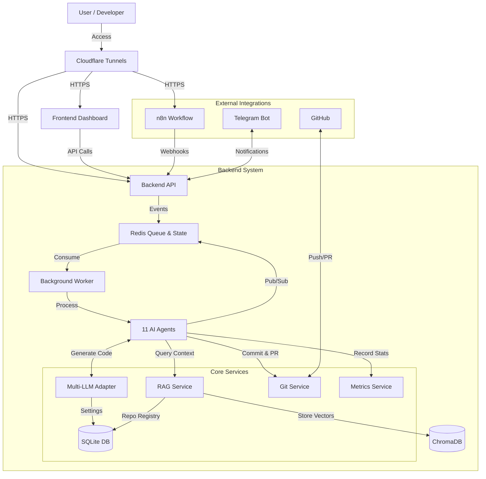

# System Architecture

## Overview
This system is an **AI-driven Autonomous Development Platform** designed to automate software creation using a multi-agent architecture. It features self-improvement capabilities where agents can modify their own codebase.

## High-Level Architecture



## Component Details

### 1. Frontend Dashboard (Vite + React)
- **Role**: User Interface for monitoring AI pipeline.
- **Tabs**:
  - **Pipeline**: Real-time agent status
  - **Logs**: Searchable log viewer
  - **Pending**: Clarification & Approval interface
  - **Stats**: Agent performance metrics
  - **Settings**: LLM adapter & repo management (NEW)

### 2. Backend (FastAPI + Python)
- **Role**: Core logic, API gateway, agent host.
- **Key Routers**:
  - `/event/ingest` - Task ingestion
  - `/pipeline/run-all` - Process entire pipeline
  - `/metrics/agents` - Performance statistics
  - `/settings/llm` - LLM adapter settings (NEW)
  - `/settings/repos` - Repository registry (NEW)
  - `/system/restart` - Self-restart API

### 3. AI Agents (11 Total)
| Agent | Description | Default LLM |
|-------|-------------|-------------|
| REQUIREMENT | 요구사항 정제 + RAG 컨텍스트 | OpenAI |
| PLAN | 로드맵/태스크 분해 | OpenAI |
| UXUI | UX/UI 설계 | OpenAI |
| ARCHITECT | 아키텍처 설계 | OpenAI |
| CODE | 코드 구현 (Git Commit) | **Claude CLI** |
| REFACTORING | 코드 리뷰 | **Cursor CLI** |
| TESTQA | 테스트 작성 (Git Commit) | OpenAI |
| DOC | 문서화 (Git Commit + PR) | OpenAI |
| RELEASE | 배포 점검 | OpenAI |
| MONITORING | 모니터링 & 재시작 승인 | OpenAI |
| EVALUATION | 성과 측정 & 개선점 도출 | OpenAI |

### 4. Multi-LLM Adapter System (NEW)
```
OpenAI API ←→ OpenAIAdapter
Claude CLI ←→ ClaudeCliAdapter  (CODE 에이전트 기본)
Cursor CLI ←→ CursorCliAdapter  (REFACTORING 에이전트 기본)
```
- 에이전트별 LLM 백엔드 선택 가능
- Settings 탭에서 변경 가능

### 5. RAG Service (NEW)
- **ChromaDB**: 벡터 데이터베이스
- **OpenAI Embeddings**: text-embedding-3-small
- **자동 인덱싱**: 10분마다 등록된 repo 재인덱싱
- REQUIREMENT 에이전트가 관련 코드 컨텍스트 조회

### 6. SQLite Database (NEW)
- **저장 위치**: `backend/data/settings.db`
- **테이블**:
  - `settings`: 일반 설정 (key-value)
  - `repositories`: 관리 대상 repo 목록
  - `llm_settings`: 에이전트별 LLM 설정

### 7. Approval Gates (NEW)
파이프라인 흐름 제어:
- `needs_clarification`: 추가 정보 대기
- `needs_approval`: 사용자 승인 대기
- `has_error`: 파이프라인 중단

### 8. Redis
- **Agent Queues**: `queue:REQUIREMENT`, `queue:PLAN`, etc.
- **Waiting States**: `waiting:clarification:*`, `waiting:approval:*`
- **Metrics**: `metrics:agent:*`

## Data Storage
```
backend/data/
├── settings.db      # SQLite 데이터베이스
├── repos/           # 클론된 저장소들
└── rag/
    └── chroma/      # ChromaDB 벡터 저장소
```

## Deployment
- Managed by `start_system.py`
- Launches Redis, Backend, Dashboard, Cloudflare Tunnels
- Sends access URLs to Telegram

