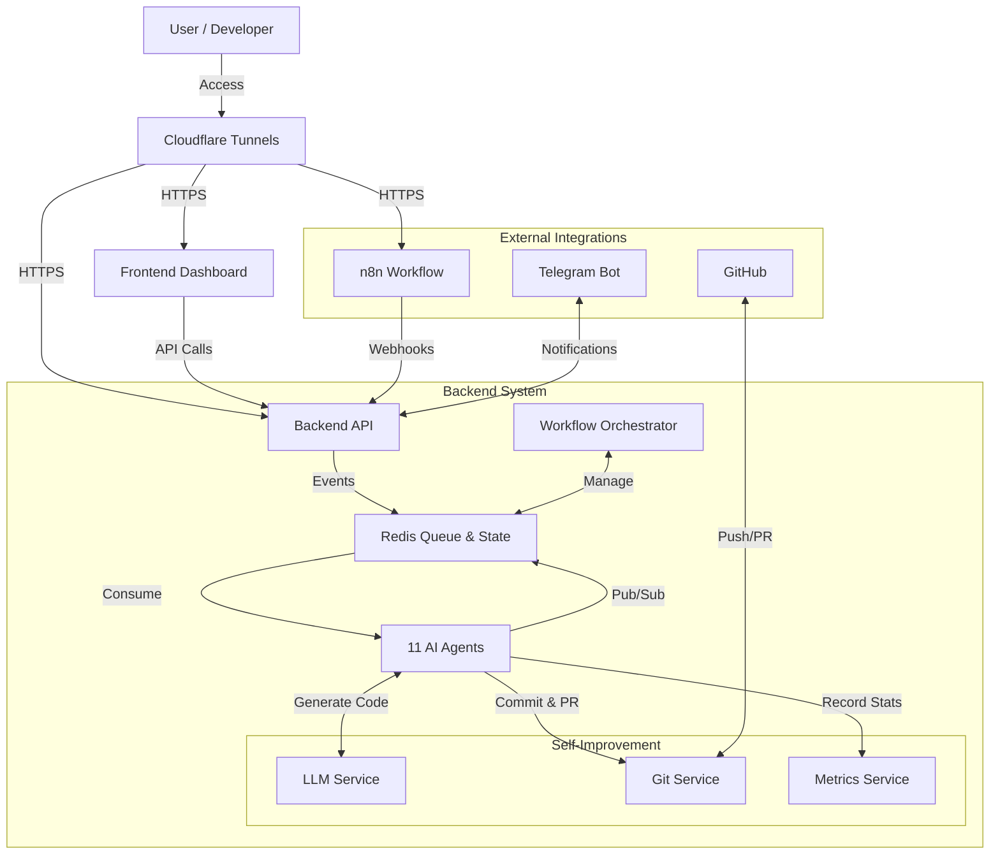

# System Architecture

## Overview
This system is an **AI-driven Autonomous Development Platform** designed to automate software creation using a multi-agent architecture. It features self-improvement capabilities where agents can modify their own codebase.

## High-Level Architecture

## Component Details

### 1. Frontend Dashboard (Vite + React)
- **Role**: User Interface for monitoring AI pipeline.
- **Tabs**:
  - **Pipeline**: Real-time agent status
  - **Logs**: Searchable log viewer
  - **Pending**: Clarification & Approval interface
  - **Stats**: Agent performance metrics (NEW)

### 2. Backend (FastAPI + Python)
- **Role**: Core logic, API gateway, agent host.
- **Key Routers**:
  - `/event/ingest` - Task ingestion
  - `/pipeline/run-all` - Process entire pipeline
  - `/metrics/agents` - Performance statistics
  - `/system/restart` - Self-restart API

### 3. AI Agents (11 Total)
| Agent | Description |
|-------|-------------|
| REQUIREMENT | 요구사항 정제 |
| PLAN | 로드맵/태스크 분해 |
| UXUI | UX/UI 설계 |
| ARCHITECT | 아키텍처 설계 |
| CODE | 코드 구현 (Git Commit) |
| REFACTORING | 코드 리뷰 |
| TESTQA | 테스트 작성 (Git Commit) |
| DOC | 문서화 (Git Commit + PR) |
| RELEASE | 배포 점검 |
| MONITORING | 모니터링 & 재시작 승인 |
| EVALUATION | 성과 측정 & 개선점 도출 |

### 4. Self-Improvement Features
- **LLMService**: OpenAI GPT-4o integration
- **GitService**: Clone, branch, commit, push, PR
- **MetricsService**: Redis-based performance tracking
- **SystemRouter**: Hot-reload capability

### 5. Redis
- **Agent Queues**: `queue:REQUIREMENT`, `queue:PLAN`, etc.
- **Metrics**: `metrics:agent:*`
- **State**: WorkItem persistence

## Deployment
- Managed by `start_system.py`
- Launches Redis, Backend, Dashboard, Cloudflare Tunnels
- Sends access URLs to Telegram
