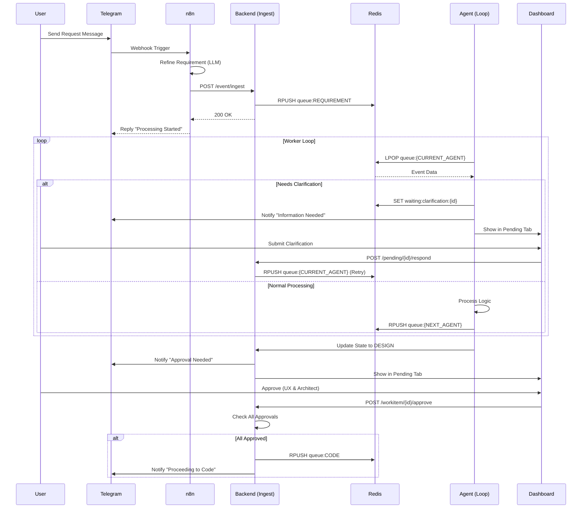

# Workflow Sequence Diagram

Uses [Mermaid](https://mermaid.js.org/) syntax for visualization.

```mermaid
sequenceDiagram
    participant User
    participant Telegram
    participant n8n
    participant Backend as Backend (Ingest)
    participant Redis
    participant Agent as Agent (Loop)
    participant Dashboard
    
    %% Ingest Phase
    User->>Telegram: Send Request Message
    Telegram->>n8n: Webhook Trigger
    n8n->>n8n: Refine Requirement (LLM)
    n8n->>Backend: POST /event/ingest
    Backend->>Redis: RPUSH queue:REQUIREMENT
    Backend-->>n8n: 200 OK
    n8n-->>Telegram: Reply "Processing Started"
    
    %% Agent Processing Phase
    loop Worker Loop
        Agent->>Redis: LPOP queue:{CURRENT_AGENT}
        Redis-->>Agent: Event Data
        alt Needs Clarification
            Agent->>Redis: SET waiting:clarification:{id}
            Agent->>Telegram: Notify "Information Needed"
            Agent->>Dashboard: Show in Pending Tab
            User->>Dashboard: Submit Clarification
            Dashboard->>Backend: POST /pending/{id}/respond
            Backend->>Redis: RPUSH queue:{CURRENT_AGENT} (Retry)
        else Normal Processing
            Agent->>Agent: Process Logic
            Agent->>Redis: RPUSH queue:{NEXT_AGENT}
        end
    end
    
    %% Approval Phase (Orchestrator)
    Agent->>Backend: Update State to DESIGN
    Backend->>Telegram: Notify "Approval Needed"
    Backend->>Dashboard: Show in Pending Tab
    
    User->>Dashboard: Approve (UX & Architect)
    Dashboard->>Backend: POST /workitem/{id}/approve
    Backend->>Backend: Check All Approvals
    
    alt All Approved
        Backend->>Redis: RPUSH queue:CODE
        Backend->>Telegram: Notify "Proceeding to Code"
    end
```
