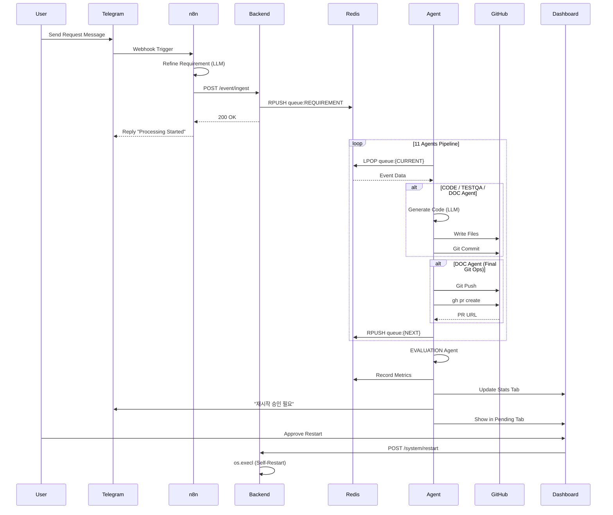

# Workflow Sequence Diagram

Visualizes the complete task lifecycle from user request to evaluation.

## Phase Summary

| Phase | Description |
|-------|-------------|
| **Ingest** | Telegram → n8n → Backend → Redis Queue |
| **Processing** | 11 Agents process sequentially via Redis queues |
| **Git Ops** | CODE/TESTQA/DOC commit files, DOC creates PR |
| **Evaluation** | EVALUATION agent scores achievement |
| **Restart** | MONITORING requests approval, Backend self-restarts |
